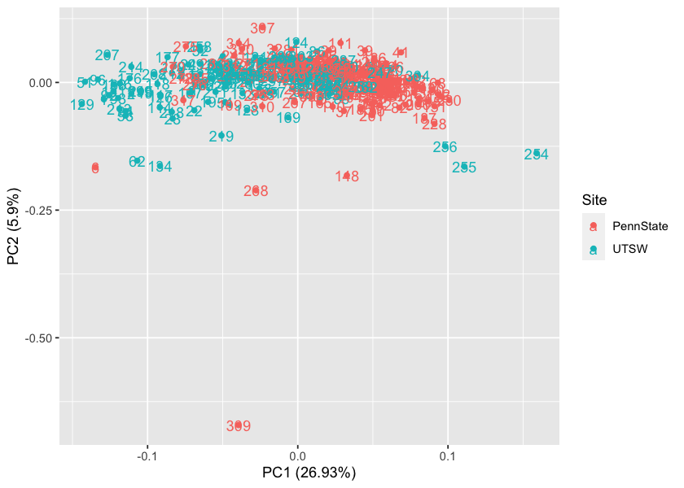
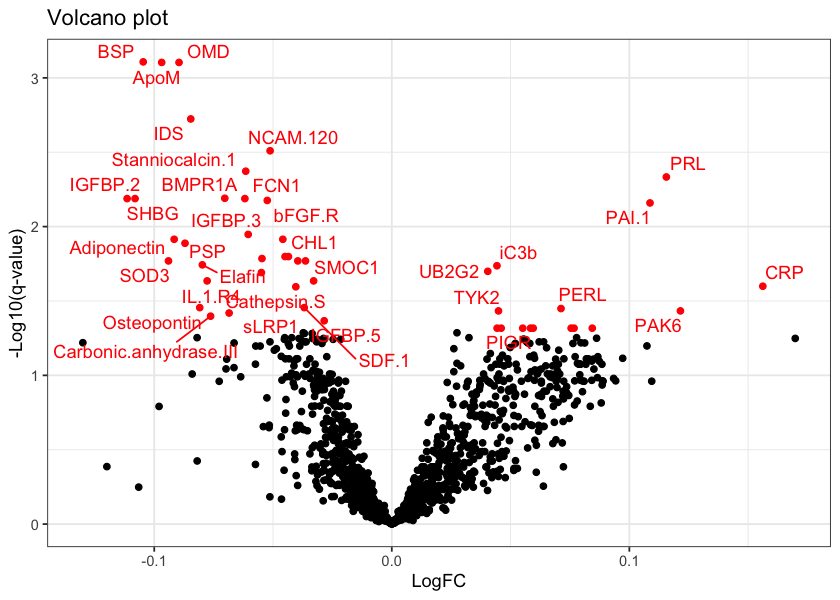
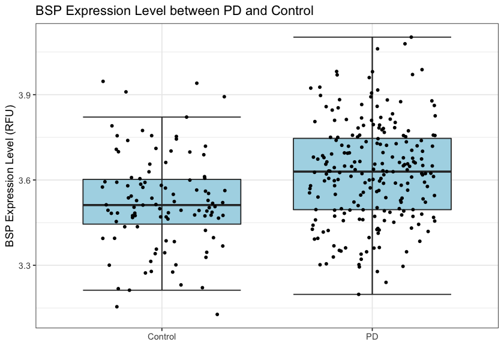
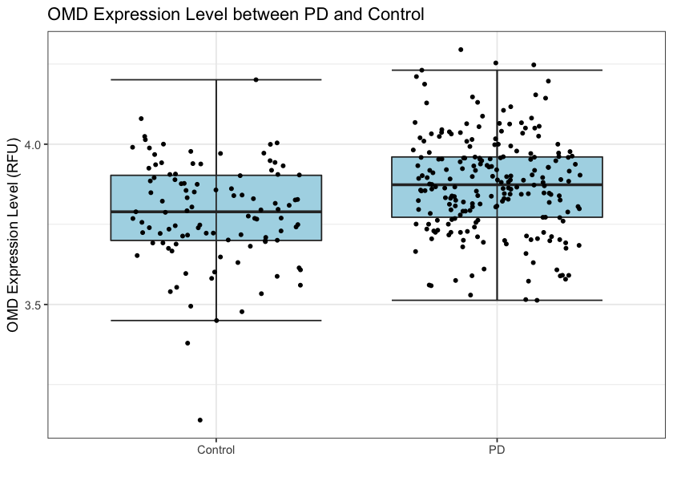
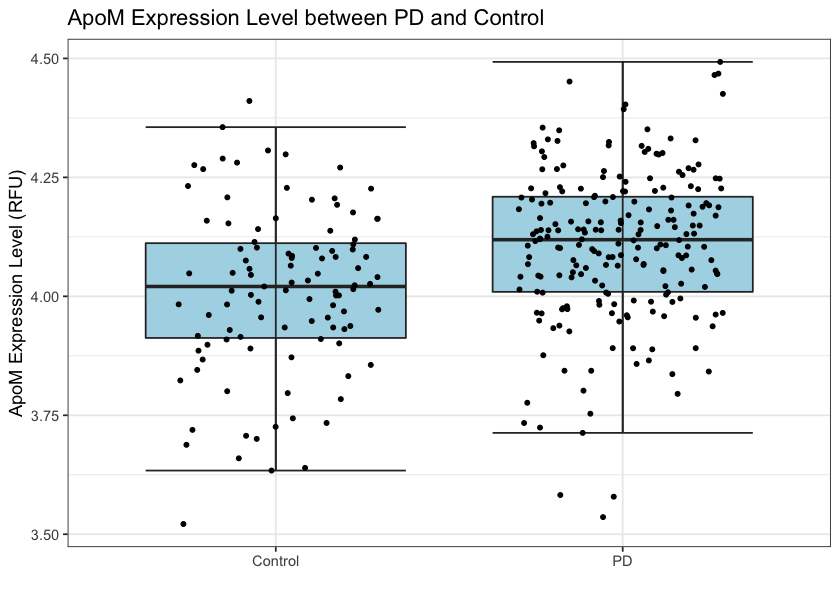
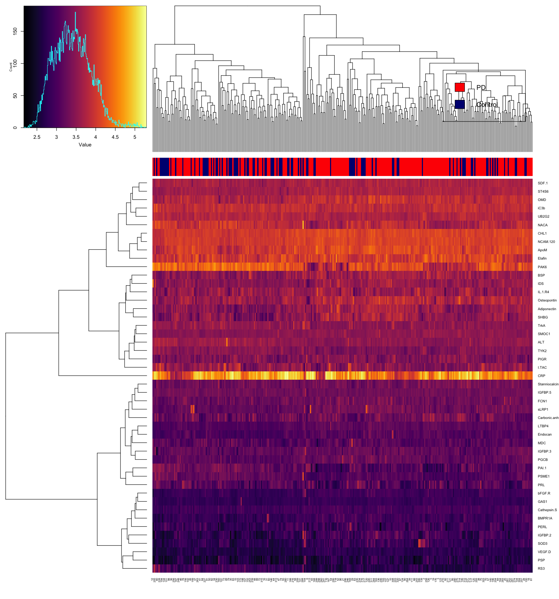
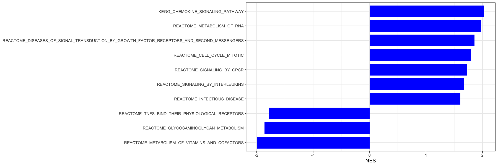
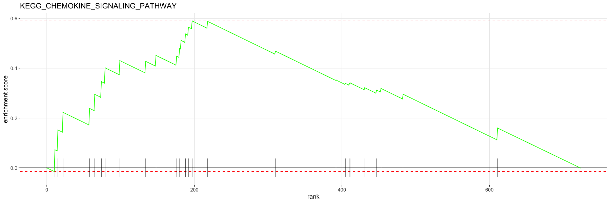
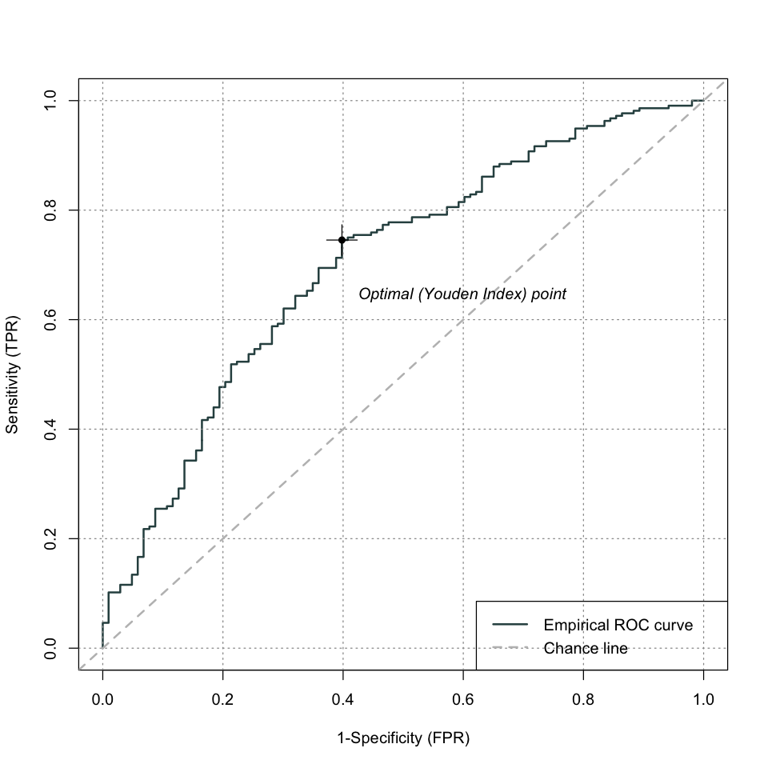

```R
# Read the proteomic dataset
df = read.csv('Protein Demographic.csv',skip = 6)
```

# I Data Pre-processing and data cleaning


```R
head(df)
```


<table class="dataframe">
<caption>A data.frame: 6 × 1313</caption>
<thead>
	<tr><th></th><th scope=col>GUID</th><th scope=col>Group</th><th scope=col>Site</th><th scope=col>Age</th><th scope=col>LDOPADoseTm</th><th scope=col>MDS_UPDRS.Total.Score</th><th scope=col>Gender</th><th scope=col>PlateId</th><th scope=col>CHIP</th><th scope=col>CEBPB</th><th scope=col>⋯</th><th scope=col>UB2G2</th><th scope=col>Transgelin.2</th><th scope=col>ATPO</th><th scope=col>Corticotropin.lipotropin</th><th scope=col>QORL1</th><th scope=col>PEDF</th><th scope=col>CATF</th><th scope=col>FTCD</th><th scope=col>UBP25</th><th scope=col>PLXB2</th></tr>
	<tr><th></th><th scope=col>&lt;chr&gt;</th><th scope=col>&lt;chr&gt;</th><th scope=col>&lt;chr&gt;</th><th scope=col>&lt;dbl&gt;</th><th scope=col>&lt;int&gt;</th><th scope=col>&lt;int&gt;</th><th scope=col>&lt;chr&gt;</th><th scope=col>&lt;chr&gt;</th><th scope=col>&lt;dbl&gt;</th><th scope=col>&lt;dbl&gt;</th><th scope=col>⋯</th><th scope=col>&lt;dbl&gt;</th><th scope=col>&lt;dbl&gt;</th><th scope=col>&lt;dbl&gt;</th><th scope=col>&lt;dbl&gt;</th><th scope=col>&lt;dbl&gt;</th><th scope=col>&lt;dbl&gt;</th><th scope=col>&lt;dbl&gt;</th><th scope=col>&lt;dbl&gt;</th><th scope=col>&lt;dbl&gt;</th><th scope=col>&lt;dbl&gt;</th></tr>
</thead>
<tbody>
	<tr><th scope=row>1</th><td>PDJA900DTV</td><td>PD     </td><td>UTSW     </td><td>75.4</td><td>900</td><td>59</td><td>Male  </td><td>Set.2</td><td>  622.8</td><td>777.0</td><td>⋯</td><td> 5486.4</td><td>2933.7</td><td>1567.9</td><td>2782.2</td><td>2847.7</td><td>77433.7</td><td>2874.4</td><td> 9335.7</td><td> 942.1</td><td>5295.8</td></tr>
	<tr><th scope=row>2</th><td>PDBC103ZEP</td><td>PD     </td><td>UTSW     </td><td>63.0</td><td>150</td><td>63</td><td>Male  </td><td>Set.2</td><td>  527.1</td><td>833.0</td><td>⋯</td><td>10159.0</td><td>3421.6</td><td>2124.9</td><td>1001.5</td><td>3324.6</td><td>74437.7</td><td>2615.5</td><td>17126.6</td><td>1314.1</td><td>5311.1</td></tr>
	<tr><th scope=row>3</th><td>PDMZ724XCN</td><td>PD     </td><td>UTSW     </td><td>80.0</td><td>180</td><td>29</td><td>Male  </td><td>Set.5</td><td>  761.1</td><td>814.6</td><td>⋯</td><td> 5151.1</td><td>4430.8</td><td>2404.4</td><td>1386.6</td><td>1178.9</td><td>59023.4</td><td>2009.1</td><td> 6272.7</td><td>1185.3</td><td>5964.7</td></tr>
	<tr><th scope=row>4</th><td>PDMH749VDY</td><td>PD     </td><td>UTSW     </td><td>66.8</td><td> 15</td><td>50</td><td>Male  </td><td>Set.4</td><td>  921.9</td><td>852.0</td><td>⋯</td><td> 3835.4</td><td>4662.8</td><td>5474.4</td><td> 941.0</td><td>2956.1</td><td>45611.9</td><td>3550.2</td><td>24817.0</td><td>1357.4</td><td>4979.6</td></tr>
	<tr><th scope=row>5</th><td>PDKL402HA0</td><td>PD     </td><td>UTSW     </td><td>63.0</td><td> NA</td><td>27</td><td>Male  </td><td>Set.1</td><td>12915.0</td><td>919.1</td><td>⋯</td><td> 3761.6</td><td>3774.6</td><td>3493.2</td><td> 811.7</td><td>1302.9</td><td>52761.7</td><td>2777.9</td><td> 8551.4</td><td>1169.2</td><td>5494.1</td></tr>
	<tr><th scope=row>6</th><td>PDFD062BTW</td><td>Control</td><td>PennState</td><td>69.6</td><td>  0</td><td> 4</td><td>Female</td><td>Set.4</td><td>  871.3</td><td>559.7</td><td>⋯</td><td> 3964.9</td><td>1916.1</td><td>4154.9</td><td> 446.1</td><td>1634.2</td><td>47292.1</td><td>2918.6</td><td>55031.6</td><td> 933.6</td><td>4092.3</td></tr>
</tbody>
</table>


```R
df= df[-321,]
```


```R
# Let's extract the columns that include proteine expression only
protein = df[9:1313]
```


```R
# Let's first normaliz the dataset using log10 transformation
protein.log = log10(protein)
```


```R
# Let's first do some quality control analysis to identify potential outliers
```


```R
protein.log = protein.log[-321,]
```


```R
dat.pca <- prcomp(protein.log,cor=F)
```

    Warning message:
    “In prcomp.default(protein.log, cor = F) :
     extra argument ‘cor’ will be disregarded”


```R
protein.log$Site = df$Site
```


```R
library(ggfortify)
options(repr.plot.width=7, repr.plot.height= 5)
library(ggplot2)
autoplot(dat.pca, data = protein.log,colour = 'Site',label = TRUE)
```


    

    


### Based on the PCA plot, looks like there exists some batch effect because red dots and green dots are separate from each other. Also, 309 seems to be an outlier. Let's remove 309 from analysis


```R
protein.log = protein.log[-309,]
df = df[-309,]
```


```R
protein.log$GUID = df$GUID
protein.log$Group = df$Group
protein.log$Site = df$Site
protein.log$Age = df$Age
protein.log$LDOPA = df$LDOPADoseTm
protein.log$UPDRS = df$UPDRS
```

# II Differential Expression Analysis (Normal vs PD)


```R
if (!requireNamespace("BiocManager", quietly = TRUE))
  install.packages("BiocManager")
BiocManager::install("GEOquery")

for (pkg in c("GEOquery", "oligo", "limma", "hgu133plus2.db", "pd.hg.u133.plus.2", "viridis", "fgsea")) {
  if (!requireNamespace(pkg, quietly = TRUE)) {
    BiocManager::install(pkg)
  }
}
```

    'getOption("repos")' replaces Bioconductor standard repositories, see
    '?repositories' for details
    
    replacement repositories:
        CRAN: https://cran.r-project.org
    
    
    Bioconductor version 3.14 (BiocManager 1.30.16), R 4.1.1 (2021-08-10)
    
    Warning message:
    “package(s) not installed when version(s) same as current; use `force = TRUE` to
      re-install: 'GEOquery'”
    Old packages: 'broom', 'caret', 'cpp11', 'crayon', 'glmnet', 'glue', 'knitr',
      'later', 'lava', 'pbdZMQ', 'readr', 'tibble', 'tinytex', 'uuid', 'xfun'
    
    Setting options('download.file.method.GEOquery'='auto')
    
    Setting options('GEOquery.inmemory.gpl'=FALSE)
    
    
    


```R
library(GEOquery)
library(oligo)
library(limma)
library(viridis)
library(GEOquery)
```


```R
design <- model.matrix(~ -1 + factor(protein.log$Group))
```


```R
colnames(design) <- levels(factor(protein.log$Group))
```


```R
fit <- lmFit(t(protein.log[,1:1305]), design)
```


```R
fit.contrast <- makeContrasts(diff = Control - PD, 
                                  levels = design)
```


```R
fit2 <- contrasts.fit(fit, fit.contrast)
```


```R
fit2 <- eBayes(fit2)
```


```R
DE_results <- topTable(fit2, coef = "diff", adjust = "BH", num = Inf)
```


```R
head(exposure_results)
```


<table class="dataframe">
<caption>A data.frame: 6 × 6</caption>
<thead>
	<tr><th></th><th scope=col>logFC</th><th scope=col>AveExpr</th><th scope=col>t</th><th scope=col>P.Value</th><th scope=col>adj.P.Val</th><th scope=col>B</th></tr>
	<tr><th></th><th scope=col>&lt;dbl&gt;</th><th scope=col>&lt;dbl&gt;</th><th scope=col>&lt;dbl&gt;</th><th scope=col>&lt;dbl&gt;</th><th scope=col>&lt;dbl&gt;</th><th scope=col>&lt;dbl&gt;</th></tr>
</thead>
<tbody>
	<tr><th scope=row>BSP</th><td>-0.10464754</td><td>3.593359</td><td>-5.094329</td><td>5.983934e-07</td><td>0.0007809034</td><td>5.729636</td></tr>
	<tr><th scope=row>ApoM</th><td>-0.09686079</td><td>4.075863</td><td>-4.924168</td><td>1.358347e-06</td><td>0.0007874847</td><td>4.955615</td></tr>
	<tr><th scope=row>OMD</th><td>-0.08956491</td><td>3.844542</td><td>-4.863440</td><td>1.810310e-06</td><td>0.0007874847</td><td>4.684825</td></tr>
	<tr><th scope=row>IDS</th><td>-0.08462367</td><td>3.545450</td><td>-4.611235</td><td>5.789065e-06</td><td>0.0018886824</td><td>3.591334</td></tr>
	<tr><th scope=row>NCAM.120</th><td>-0.05122450</td><td>4.073848</td><td>-4.450289</td><td>1.184483e-05</td><td>0.0030915011</td><td>2.920094</td></tr>
	<tr><th scope=row>Stanniocalcin.1</th><td>-0.06148008</td><td>3.318286</td><td>-4.335366</td><td>1.950327e-05</td><td>0.0042419619</td><td>2.453662</td></tr>
</tbody>
</table>


```R
library(ggplot2)
library("ggrepel")
# Assign (in)significant genes
exposure_results$sig <- rep("insignificant", nrow(exposure_results))
exposure_results$sig[which(exposure_results$adj.P.Val<0.05)] <- "significant"
v1 = ggplot(exposure_results, aes(x = logFC, y = -log10(adj.P.Val), color = sig)) + 
  geom_point() +
  theme_bw() +
  ggtitle("Volcano plot") +
  xlab("LogFC")+
  ylab("-Log10(q-value)") +
  scale_color_manual(values = c("black", "red")) +
  theme(legend.position = "none")

v1+geom_text_repel(data=head(exposure_results, 40), aes(label=rownames(exposure_results)[1:40]))
```

    Warning message:
    “ggrepel: 1 unlabeled data points (too many overlaps). Consider increasing max.overlaps”


    

    


```R
dict = read.csv('Protein Demographic.csv',skip = 1)
```


```R
dict1 = t(dict[4:5,])[-1:-8,]
rownames(dict1) = NULL
colnames(dict1) = c('SYMBOL','Protein.Name')
exposure_results$Protein.Name = rownames(exposure_results)
protein_gene = merge(exposure_results,dict1,by = 'Protein.Name')
```


```R
DE_res = protein_gene
```


```R
write.table(exposure_results, "./Protein_DE_results.txt", row.names = F, 
            col.names = T, quote = F, sep = "\t")
```


```R
df_boxplot1 = data.frame(
  expression = protein.log[,'BSP'],
  status = protein.log$Group)
```


```R
ggplot(df_boxplot1, aes(x = status, y = expression)) +
  geom_boxplot(outlier.colour = NA, color = "grey18", fill = "lightblue") +
  stat_boxplot(geom = "errorbar", color = "grey18") +
  geom_jitter(size = 1, position = position_jitter(width = 0.3)) +
  ggtitle("BSP Expression Level between PD and Control") +
  xlab(" ") +
  ylab("BSP Expression Level (RFU)") +
  theme_bw() +
  theme(legend.position = "none")
```


    

    


```R
df_boxplot2 = data.frame(
  expression = protein.log[,'OMD'],
  status = protein.log$Group)
```


```R
ggplot(df_boxplot2, aes(x = status, y = expression)) +
  geom_boxplot(outlier.colour = NA, color = "grey18", fill = "lightblue") +
  stat_boxplot(geom = "errorbar", color = "grey18") +
  geom_jitter(size = 1, position = position_jitter(width = 0.3)) +
  ggtitle("OMD Expression Level between PD and Control") +
  xlab(" ") +
  ylab("OMD Expression Level (RFU)") +
  theme_bw() +
  theme(legend.position = "none")
```


    

    


```R
df_boxplot3 = data.frame(
  expression = protein.log[,'ApoM'],
  status = protein.log$Group)
```


```R
ggplot(df_boxplot3, aes(x = status, y = expression)) +
  geom_boxplot(outlier.colour = NA, color = "grey18", fill = "lightblue") +
  stat_boxplot(geom = "errorbar", color = "grey18") +
  geom_jitter(size = 1, position = position_jitter(width = 0.3)) +
  ggtitle("ApoM Expression Level between PD and Control") +
  xlab(" ") +
  ylab("ApoM Expression Level (RFU)") +
  theme_bw() +
  theme(legend.position = "none")
```


    

    


```R
options(repr.plot.width=14, repr.plot.height= 15)
library(gplots)
# keep top 200 genes
top_results <- subset(exposure_results,sig =='significant')
top.eset <- protein.log[colnames(protein.log) %in% row.names(top_results)]
status.colors <- unlist(lapply(protein.log$Group, 
                               function (x) {if (x == "PD") "red"  
                                 else "navy"}))
heatmap.2(t(top.eset), col = viridis(256, option = "B"),
          trace = "none", keysize = 1.5, key.title = NA,
          ColSideColors = status.colors)
legend("topright", legend = c("PD","Control"), fill = c("red", "navy")) 
```


    

    


```R
library(fgsea)
kegg <- gmtPathways("./c2.cp.kegg.v7.4.symbols.gmt")
reactome <- gmtPathways("./c2.cp.reactome.v7.4.symbols.gmt")
pathways <- c(kegg, reactome)
head(DE_res)
```


<table class="dataframe">
<caption>A data.frame: 6 × 8</caption>
<thead>
	<tr><th></th><th scope=col>logFC</th><th scope=col>AveExpr</th><th scope=col>t</th><th scope=col>P.Value</th><th scope=col>adj.P.Val</th><th scope=col>B</th><th scope=col>sig</th><th scope=col>Protein.Name</th></tr>
	<tr><th></th><th scope=col>&lt;dbl&gt;</th><th scope=col>&lt;dbl&gt;</th><th scope=col>&lt;dbl&gt;</th><th scope=col>&lt;dbl&gt;</th><th scope=col>&lt;dbl&gt;</th><th scope=col>&lt;dbl&gt;</th><th scope=col>&lt;chr&gt;</th><th scope=col>&lt;chr&gt;</th></tr>
</thead>
<tbody>
	<tr><th scope=row>1</th><td>-0.10464754</td><td>3.593359</td><td>-5.094329</td><td>5.983934e-07</td><td>0.0007809034</td><td>5.729636</td><td>significant</td><td>BSP            </td></tr>
	<tr><th scope=row>2</th><td>-0.09686079</td><td>4.075863</td><td>-4.924168</td><td>1.358347e-06</td><td>0.0007874847</td><td>4.955615</td><td>significant</td><td>ApoM           </td></tr>
	<tr><th scope=row>3</th><td>-0.08956491</td><td>3.844542</td><td>-4.863440</td><td>1.810310e-06</td><td>0.0007874847</td><td>4.684825</td><td>significant</td><td>OMD            </td></tr>
	<tr><th scope=row>4</th><td>-0.08462367</td><td>3.545450</td><td>-4.611235</td><td>5.789065e-06</td><td>0.0018886824</td><td>3.591334</td><td>significant</td><td>IDS            </td></tr>
	<tr><th scope=row>5</th><td>-0.05122450</td><td>4.073848</td><td>-4.450289</td><td>1.184483e-05</td><td>0.0030915011</td><td>2.920094</td><td>significant</td><td>NCAM.120       </td></tr>
	<tr><th scope=row>6</th><td>-0.06148008</td><td>3.318286</td><td>-4.335366</td><td>1.950327e-05</td><td>0.0042419619</td><td>2.453662</td><td>significant</td><td>Stanniocalcin.1</td></tr>
</tbody>
</table>


```R
library(dplyr)
DE_res <- DE_res %>%
  filter(!is.na(SYMBOL)) %>%
  group_by(SYMBOL) %>%
  arrange(P.Value) %>%
  filter(row_number() == 1) %>%
  data.frame()

```


```R
gene_list <- DE_res$t
names(gene_list) <- DE_res$SYMBOL
gene_list <- sort(gene_list, decreasing = T)
head(gene_list, 5)

```


<style>
.dl-inline {width: auto; margin:0; padding: 0}
.dl-inline>dt, .dl-inline>dd {float: none; width: auto; display: inline-block}
.dl-inline>dt::after {content: ":\0020"; padding-right: .5ex}
.dl-inline>dt:not(:first-of-type) {padding-left: .5ex}
</style><dl class=dl-inline><dt>PRL</dt><dd>4.27830397189947</dd><dt>C3</dt><dd>3.61302901263841</dd><dt>UBE2G2</dt><dd>3.57906327683973</dd><dt>CRP</dt><dd>3.47624907220672</dd><dt>LPO</dt><dd>3.34312445029903</dd></dl>


```R
options(warn=-1)
fgseaRes <- fgsea(pathways = pathways, stats = gene_list, minSize = 15, 
                 maxSize = 500, nperm = 10000, gseaParam = 1)
fgseaRes <- fgseaRes[order(fgseaRes$pval), ]

collapsedPathways <- collapsePathways(fgseaRes = fgseaRes[padj < 0.05], 
                                      pathways = pathways, stats = gene_list)
mainPathways <- fgseaRes[pathway %in% collapsedPathways$mainPathways] # keep results of independent pathways

top_pathway <- mainPathways %>%
  filter(padj < 0.05 & abs(NES) > 1) %>%
  arrange(NES)

options(repr.plot.width=5, repr.plot.height= 5)
# convert pathways to factors where the levels are the same as pathway order

```

    
    
    
    
    
    
    
    
    
    
    
    
    
    
    
    
    
    
    
    


```R
options(repr.plot.width=15, repr.plot.height= 5)
top_pathway$pathway <- factor(top_pathway$pathway, levels = top_pathway$pathway)
ggplot(top_pathway, aes(y = NES, x = pathway)) +
  geom_bar(width = 0.8, position = position_dodge(width = 0.8), stat = "identity", fill = "blue") + 
  coord_flip() +
  theme_bw() +
  theme(
    axis.title.y = element_blank()
  )
```


    

    


```R
plotEnrichment(pathway = pathways[["KEGG_CHEMOKINE_SIGNALING_PATHWAY"]], stats = gene_list) + 
  labs(title="KEGG_CHEMOKINE_SIGNALING_PATHWAY")

top_pathway %>% 
  filter(pathway=="KEGG_CHEMOKINE_SIGNALING_PATHWAY") %>% 
  dplyr::select(leadingEdge) %>% 
  unlist() %>% 
  unname()
         
```


<style>
.list-inline {list-style: none; margin:0; padding: 0}
.list-inline>li {display: inline-block}
.list-inline>li:not(:last-child)::after {content: "\00b7"; padding: 0 .5ex}
</style>
<ol class=list-inline><li>'CCL22'</li><li>'CCL27'</li><li>'CCL5'</li><li>'CSK'</li><li>'RAC1'</li><li>'MAPK1'</li><li>'STAT1'</li><li>'STAT3'</li><li>'PRKACA'</li><li>'CRK'</li><li>'LYN'</li><li>'VAV1'</li><li>'CCL18'</li><li>'CCL17'</li><li>'FGR'</li><li>'SHC1'</li><li>'PIK3CG'</li></ol>


    

    


# Classification Model of the Disease (PD vs Normal)


```R
library(caret)
library(e1071)
library(precrec)
library(ROCit)
```


```R
install.packages('ROCit', dependencies = TRUE)
```

    Updating HTML index of packages in '.Library'
    
    Making 'packages.html' ...
     done
    


```R
### Let's train the model using 4 proteins that passed the p value threshold of 0.05 on both cohorts
train_control <- trainControl(method = "repeatedcv", number = 5, repeats = 50)
model <- train(as.factor(Group) ~
                        Age+
                        ApoM+
                        BSP+
                        OMD,
                        method = "glm",
                        data = protein.log,
                        na.action=na.omit,
                        family = binomial)

# Let's take a look at the final model
summary(model)

```


    
    Call:
    NULL
    
    Deviance Residuals: 
        Min       1Q   Median       3Q      Max  
    -2.0897  -1.1565   0.6489   0.8524   1.7764  
    
    Coefficients:
                  Estimate Std. Error z value Pr(>|z|)    
    (Intercept) -20.709625   3.971965  -5.214 1.85e-07 ***
    Age           0.001618   0.013884   0.117  0.90720    
    ApoM          2.291085   0.859792   2.665  0.00771 ** 
    BSP           2.221495   0.970559   2.289  0.02209 *  
    OMD           1.068406   1.148280   0.930  0.35214    
    ---
    Signif. codes:  0 ‘***’ 0.001 ‘**’ 0.01 ‘*’ 0.05 ‘.’ 0.1 ‘ ’ 1
    
    (Dispersion parameter for binomial family taken to be 1)
    
        Null deviance: 401.32  on 318  degrees of freedom
    Residual deviance: 364.67  on 314  degrees of freedom
    AIC: 374.67
    
    Number of Fisher Scoring iterations: 4


```R
# Plot ROC curve with AUC score
options(repr.plot.width=8, repr.plot.height=8)
predict_train1 <- predict(model, newdata = protein.log, type= "prob")
precrec_obj <- rocit(class = protein.log$Group, score = predict_train1$PD)
plot(precrec_obj)
```


    

    


```R
summary(precrec_obj)
```

                               
     Method used: empirical    
     Number of positive(s): 216
     Number of negative(s): 103
     Area under curve: 0.7004  


## With 3 proteins, the Logistic Regression Model based classifier differentiate PD from Control with a sensitivity of 0.7


```R

```
